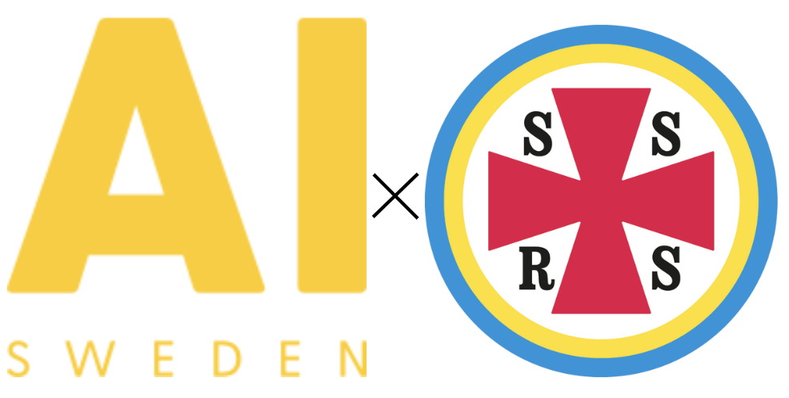

<!-- PROJECT LOGO -->
<br />
<div align="center">
  <a href="https://github.com/Tegelstenen/SSRS">
    
  </a>

  <h3 align="center">AI for impact X SSRS</h3>

  <p align="center">
    A summer internship aimed to assist the Swedish Sea Resuce Society (SSRS) with predictive maintenance of their vessels and GPS anomalies.
    <br />
 

[](https://www.linkedin.com/in/filipsjostrand​) [](https://www.linkedin.com/in/axel-karlsson-16251871​) [](https://www.linkedin.com/in/theo-larsson-malmstedt/)

</div>

  </p>
</div>


<!-- ABOUT THE PROJECT -->
## About The Project

<div align="center">
  <a href="https://github.com/Tegelstenen/SSRS">
    
  </a>

</div>

For non profit organizations provide vital services to society as a whole. Their existance is often depended upon their memebrs volunteering and donations. These organization are driven by the passion of doing good and usually lack the continous development found in most companies. As a consequence, many of these organizations lack the resources to maintain and catch up with the latest technological advancements. AI for impact is a program funded by Google.org that aims to bridge this gap by helping non-profits implement AI solutions to their operational problems.

This project is in partnership with the Swedish Sea Resuce Society (SSRS) and AI Sweden, driven by three university students. Given the time constraints, the project has focuse on analysing engine data for predicitive maintenance as well as analysis of geographical data to identify potential GPS jammings and spoofings.


### Built With
<div align="center">

   

</div>

<!-- GETTING STARTED -->
## Getting Started

The project is divide into three main components with each having its own `main.py`.
```sh
SSRS/
├── dashboard/
│   ├── ...
│   └── main.py
├── models/
│   ├── ...
│   └── main.py
├── pipeline/
│   ├── ...
│   └── main.py
└── .../
```

Begin by creating a virtual environment and installing the dependencies.

```sh
python -m venv env
source env/bin/activate
pip install -r requirements.txt
```

Also, create the necessary `.env` file with the following variables:
```
TOKEN='influxDB token'
API_KEY_STADIA='Stadia API key'
ACCESS_KEY='AWS access key'
SECRET_KEY='AWS secret key'
```

<!-- USAGE EXAMPLES -->
## Usage

#### Pipeline
The pipeline is responsible for ingesting data from the SSRS database and preprocess it for the models. To run the pipeline, run the following command:

```sh
python pipeline/main.py start_date end_date directory_to_save_data
```

For example:
 ```sh
python pipeline/main.py 2024-01-01 2024-01-02 models/data
```

<details><summary style="font-size: 14px; font-weight: bold;">Extended Description</summary>

Everythin is orchastrated under the `main.py` file. The steps taken are:

1. Querying to the database using `db_query.py`
    * First we find the seuence where RPM is greater or equal to 0 to find where the boats are actually moving.
    * This is used to determining boat trips for each boat and then we make the queries on all of the data based of these trips
    * This saves a lot of different csv files for each boat, each trip, and each variable, like:
    ```
    data/
    └── c710dd10-8987-4216-bf82-6fef6cf5225c/
        ├── Trip1/
        │   ├── RPM.csv
        │   ├── COG.csv
        │   ├── ...
        └── Trip2/
            ├── ...
    ```
2. Then we make som initial processing inside `process_raw.py` of the individual csv files to create two merged csv files `engine_data.csv` `geo_data.csv`
    * `engine_data.csv` contains the data pertaining to the engine (i.e., they have a value to `signal_instance`)
        $\longrightarrow$ `RPM`
        $\longrightarrow$`ENGTEMP`
        $\longrightarrow$`ENGHOURS`
        $\longrightarrow$`ENGLOAD`
        $\longrightarrow$`FUELRATE`
        $\longrightarrow$`ENGINE_LOAD`
    * `geo_data.csv` contains the data pertaining to the GPS (i.e., they lack a value to `signal_instance`)
        $\longrightarrow$`COG`
        $\longrightarrow$`SOG`
        $\longrightarrow$`LON`
        $\longrightarrow$`LAT`


        
        DataCleaner()

3. We follow with `widen.py` which pivots to a wide format keeping `node_name`, `date`, and `signal_instance` as index.

4. The `sequence.py` ensure that our time series data is sequential.
    * Some of the data points are collected at different time steps.
    We utilise an averaged value for each 5th second to ensure no NaN values and linear observations.

5. Next, we impute the missing values with `impute.py`. Here we group by `boat` and `TRIP_ID` and then use a forward fill.
    * We are assuming not much is happening within potential gaps in the 5 second windows created in the previous step.
5. Then we create a merged dataframe with `merge.py`
6. To make better use of the geographical data we add weather conditions using `weather.py`
    * This script fetches from ... and does ...
    * The result is `wind_velocity` and `alignment_factor` features added to the dataframe
7. The final `final_cleanup.py` does minimal alteration to the data to fit what we have in the models.

</details>


#### Models

The model is responsible for training and inferring with a trained model. To run the model, run the following command:

```sh
python models/main.py --mode mode --model model
```

For example:

 ```sh
python models/main.py --mode lstm --model infer
```

There are two modes: `train` and `infer`. The `train` mode is used to train the model and the `infer` mode is used to infer with a trained model.

There are two models: `lstm` and `autoencoder`. The `lstm` is an LSTM autoencoder model and 'autoencoder' is a simple autoencoder model.

<details><summary style="font-size: 14px; font-weight: bold;">Extended Description</summary>

BLA BLA BLA

</details>

#### Dashboard

The dashboard is responsible for visualizing the data and the inference results. To run the dashboard locally, run the following command:

```sh
streamlit run dashboard/main.py
```

Otherwise, the dashboard is hosted on [Streamlit Cloud](https://ssrs-anomaly.streamlit.app/) behind a password.

<details><summary style="font-size: 14px; font-weight: bold;">Extended Description</summary>
 
BLA BLA BLA

</details>


<!-- CONTACT -->
## Contact

Feel free to reach out to any of the team members for more information. We are always open to discuss new ideas and collaborations.

[Filip Sjöstrand](mailto:f.w.sjostrand@gmail.com?subject=Questions%20regarding%20AI%20for%20impact%20-%20SSRS&body=Hello%2C%20I%20found%20your%20contact%20in%20the%20SSRS%20GitHub%20repo.%0D%0A%0D%0A...) — [Axel Karlsson](mailto:axeka624@student.liu.se?subject=Questions%20regarding%20AI%20for%20impact%20-%20SSRS&body=Hello%2C%20I%20found%20your%20contact%20in%20the%20SSRS%20GitHub%20repo....) - [Theo Malmstedt](mailto:theo.js.malmstedt@gmail.com?subject=Questions%20regarding%20AI%20for%20impact%20-%20SSRS&body=Hello%2C%20I%20found%20your%20contact%20in%20the%20SSRS%20GitHub%20repo....) 
